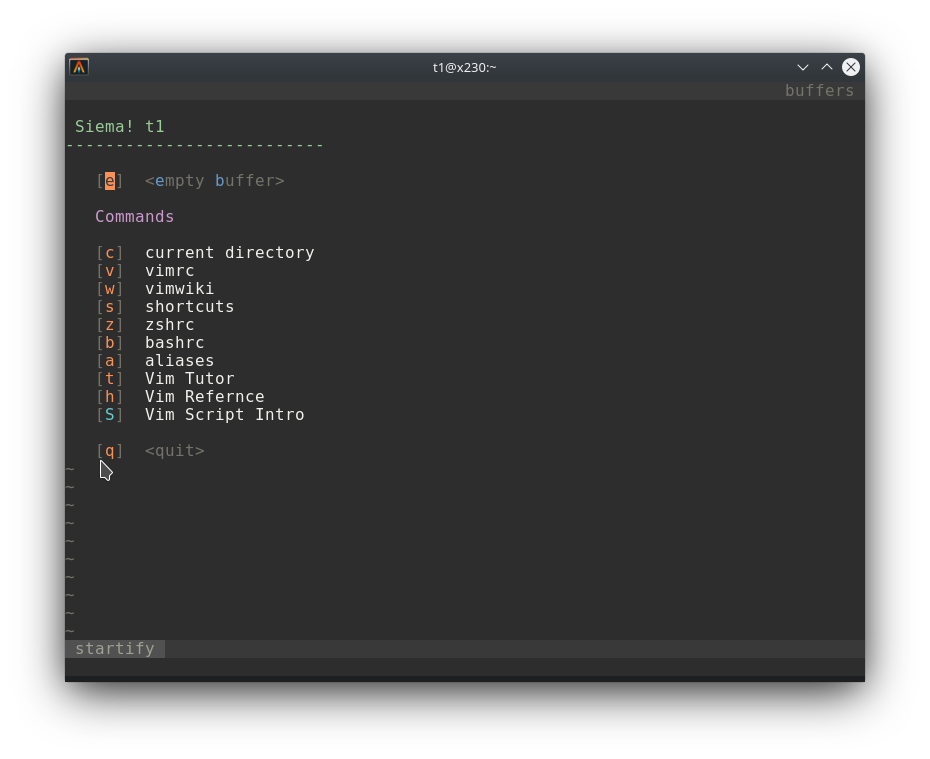
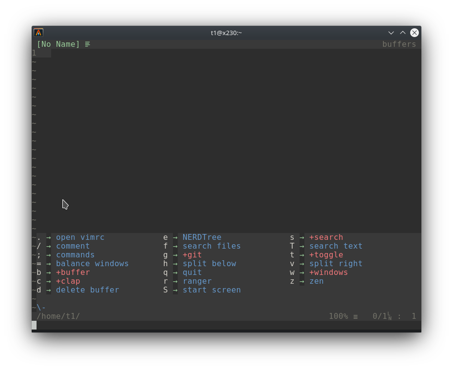
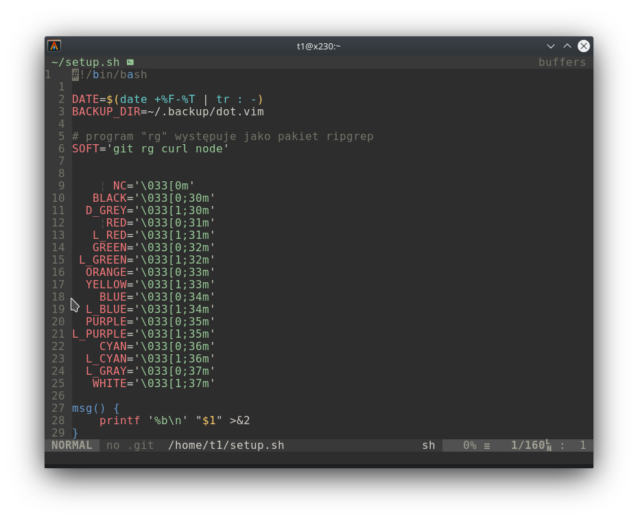

# vimrc

## Wymagane oprogramowanie

- Git
- FZF
- ripgrep
- curl
- node - jest wymagany przez plugin [coc.nvim](https://github.com/neoclide/coc.nvim)

## Instalacja

Pobranie skryptu instalacyjnego

```
curl -sLf https://git.io/JfGN7 -o setup.sh
bash ./setup.sh
```

## Ustawienia

- Taby są ustawione jako 4 znaki spacji
- Linie są automatycznie zawijane przy 80 kolumnie linii


## Zarządzanie pluginami

vim-plug https://github.com/junegunn/vim-plug

Komendy `PlugInstall` oraz `PlugUpdate`

## Skróty klawiszowe

Edytor Vim posiada klawisz o nazwie **leader**. W tej konfiguracji tym klawiszem
jest **SPACJA**. Jeśli znajdziesz zapis typu `<leader>n` oznacza on użycie kombinacji
klaiwszy `spacja n`

Skróty klawiszowe znajdują się w pliku `~/.vim/vimrc_mappings.vim`, dodatkowo
za pomocą pluginu `vim-which-key` można uzyskać pomoc dotyczącą skrótów klawiszowych
zaczynających się od znaku `\`.

Kolejnym przydatnym pluginem jest `Cheat40` można go uruchomić za pomocą komendy
`:Cheat40` lub za pomocą skrótu `<leader>c`

| Skrót            | Opis                                                              |
|------------------|-------------------------------------------------------------------|
| `qq`             | Wyjście bez zapisania                                             |
| `qw`             | Zapisanie i wyjście                                               |
| `<leader>;`      | Wejście w tryb komend `:`                                         |
| `jj`, `kk`, `kj` | W trybie INSERT `jj`, `kk` i `kj` działa jak klawisz `ESC`        |
| `gh`             | Zamiennik `0`, czyli pierwszy znak linii                          |
| `gl`             | Zamiennik `$`, czyli ostatni znak linii                           |
| `Ctrl-/`         | Komentuje linie w trybie NORMAL i VISUAL                          |
| `<leader>n`      | Uruchamia menadżer plików NERDTree                                |
| `<leader>e`      | Uruchamia menadżer plików CocExplorer                             |
| `<leader>c`      | Uruchamia podręczną pomoc plugin Cheat40                          |
| `<leader>f`      | Uruchamia polecenie `:Files`                                      |
| `<c-h>`          | przechodzi do okna po lewej                                       |
| `<c-l>`          | przechodzi do okna po prawej                                      |
| `<c-j>`          | przechodzi do okna niżej                                          |
| `<c-k>`          | przechodzie do okna wyżej                                         |
| `<leader>vv`     | otwiera plik `$MYVIMRC` czyli `~/.vim/vimrc`                      |
| `<leader>vs`     | otwiera plik `$MYVIMRC` czyli `~/.vim/vimrc` z podziałem pionowym |
| `<leader>vm`     | otwiera plik `~/.vim/vimrc_mappings.vim`                          |
| `<leader>vp`     | otwiera plik `~/.vim/vimrc_plugins.vim`                           |
| `<leader>r`      | przeładowuje konfigurację                                         |
| `<leader>a`      | wyrównanie paragrafu i zawinięcie długich linii na 80 znaków      |
| `<leader>cp`     | klonuje cały paragraf                                             |
| `<leader>cd`     | zmienia katalog na katalog edytowanego pliku                      |
| `<TAB>`          | przechodzi pomiędzy dwoma ostatnimi buforami                      |
| `<leader>ts`     | otwiera terminal                                                  |
| `<leader>tv`     | otwiera terminal w oknie po prawej                                |
| `<c-/>`          | komentuje bieżącą linię                                           |
| `<leader>n`      | uruchamia przeglądarkę plików NERDTree                            |
| `<leader>f`      | wyszukuje pliki w bieżącym katalogu za pomocą FZF                 |
| `th`             | wyłącza podświetlanie znalezionego wyrażenia                      |

## Skróty w trybie COMMAND

| Skrót   | Opis                                                 |
|---------|------------------------------------------------------|
| `<c-k>` | strzałka w górę  - poruszanie się po historii komend |
| `<c-j>` | strzałka w dół   - poruszanie się po historii komend |
| `<c-h>` | strzałka w lewo  - poruszanie się w linii            |
| `<c-l>` | strzałka w prawo - poruszanie się w linii            |

## Skróty w trybie INSERT

| Skrót   | Opis             |
|---------|------------------|
| `<c-k>` | strzałka w górę  |
| `<c-j>` | strzałka w dół   |
| `<c-h>` | strzałka w lewo  |
| `<c-l>` | strzałka w prawo |

## Skróty klawiszowe Startify

| Skrót | Opis                                               |
|-------|----------------------------------------------------|
| `c`   | otwiera menadżer plików w bieżącej lokalizacji     |
| `v`   | otwiera plik konfiguracyjny `vimrc`                |
| `V`   | otwiera Vimwiki plugin do tworzenia lokalnego Wiki |
| `s`   | otwiera plik README.md ze skrótami klawiszowymi    |
| `z`   | otwiera plik konfiguracyjny `~/.zshrc`             |
| `b`   | otwiera plik konfiguracyjny `~/.bashrc`            |
| `a`   | otwiera plik z aliasami `~/.aliases`               |
| `t`   | otwiera tutorial dla edytora Vim                   |
| `h`   | otwiera pomoc Vim Reference Manual                 |
| `S`   | otwiera pomoc Vim Script Intro                     |

## Przydatne komendy

- `:FZF`     - wyszukiwanie plików
- `:Files`   - wyszukiwanie plików z podlądem
- `:Buffers` - lista buforów
- `:Colors`  - lista kolorów
- `:Maps`    - lista skrótów klawiszowych

## Zarządzanie sesjami

Do zarządzania sesjami służy plugin Startify

- `SSave [nazwa-sesji]` - zapisanie sesji
- `SLoad [nazwa-sesji]` - odtworzenie sesji
- `SClose` - zakończenie sesji
- `SDelete [nazwa-sesji]` - usunięcie sesji

## Plugin vim-sneak

- https://github.com/justinmk/vim-sneak

Sneak Commands

```
s{char}{char}
S{char}{char}

f{char}
F{char}

t{char}
F{char}
```

## Screenshoty

### Ekran startowy



### Podręczna pomoc

Za pomocą klawisza `\` włącza się podręczną pomoc



### Schemat kolorów



## Zainstalowane pluginy

- [NERDTree](https://github.com/scrooloose/nerdtree)
- [coc.nvim](https://github.com/neoclide/coc.nvim)
- [ctrlsf.vim](https://github.com/dyng/ctrlsf.vim)
- [fzf-preview.vim](https://github.com/chengzeyi/fzf-preview.vim)
- [fzf.vim](https://github.com/junegunn/fzf.vim)
- [fzf](https://github.com/junegunn/fzf)
- [gist-vim](https://github.com/mattn/gist-vim)
- [goyo.vim](https://github.com/junegunn/goyo.vim)
- [gruvbox](https://github.com/morhetz/gruvbox)
- [gv.vim](https://github.com/junegunn/gv.vim)
- [indentLine](https://github.com/yggdroot/indentLine)
- [limelight.vim](https://github.com/junegunn/limelight.vim)
- [nerdtree-git-plugin](https://github.com/Xuyuanp/nerdtree-git-plugin)
- [quick-scope](https://github.com/unblevable/quick-scope)
- [rainbow](https://github.com/luochen1990/rainbow)
- [targets.vim](https://github.com/wellle/targets.vim)
- [terminus](https://github.com/wincent/terminus)
- [ultisnips](https://github.com/SirVer/ultisnips)
- [undotree](https://github.com/mbbill/undotree)
- [vim-airline-themes](https://github.com/vim-airline/vim-airline-themes)
- [vim-airline](https://github.com/vim-airline/vim-airline)
- [vim-bookmarks](https://github.com/MattesGroeger/vim-bookmarks)
- [vim-cheat40](https://github.com/lifepillar/vim-cheat40)
- [vim-clap](https://github.com/liuchengxu/vim-clap)
- [vim-commentary](https://github.com/tpope/vim-commentary)
- [vim-devicons](https://github.com/ryanoasis/vim-devicons)
- [vim-easymotion](https://github.com/easymotion/vim-easymotion)
- [vim-fugitive](https://github.com/tpope/vim-fugitive)
- [vim-gnupg](https://github.com/jamessan/vim-gnupg)
- [vim-highlightedyank](https://github.com/machakann/vim-highlightedyank)
- [vim-hybrid-material](https://github.com/kristijanhusak/vim-hybrid-material)
- [vim-illuminate](https://github.com/RRethy/vim-illuminate)
- [vim-repeat](https://github.com/tpope/vim-repeat)
- [vim-sensible](https://github.com/tpope/vim-sensible)
- [vim-signify](https://github.com/mhinz/vim-signify)
- [vim-sneak](https://github.com/justinmk/vim-sneak)
- [vim-snippets](https://github.com/honza/vim-snippets)
- [vim-startify](https://github.com/mhinz/vim-startify)
- [vim-surround](https://github.com/tpope/vim-surround)
- [vim-tomorrow-theme](https://github.com/chriskempson/vim-tomorrow-theme)
- [vim-which-key](https://github.com/liuchengxu/vim-which-key)
- [vima-easy-align](https://github.com/junegunn/vim-easy-align)
- [vimwiki](https://github.com/vimwiki/vimwiki)
- [webapi-vim](https://github.com/mattn/webapi-vim)

## Pluginy dodatkowe

- [vim-go](https://github.com/fatih/vim-go)
- [YouCompleteMe](https://github.com/ycm-core/YouCompleteMe)
